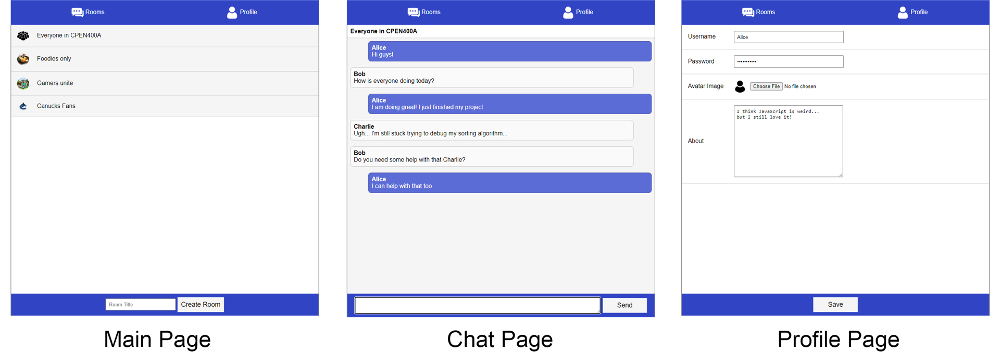

# web_chat_app
## Keywords
Web application: Full-stack, HTML, CSS, Javascript, NodeJS, MongoDB, express, WebSocket

## Project overview
This web app is an online discussion forum where anyone can create a chat room about a topic and people can have live chat using the application.
* client-side GUI where user can login, create a chat room, have live chat with friends etc.
* Dynamically rendered client-side application, following a Model-View-Control(MVC) pattern
* exchange data with server thorugh AJAX requests and WebSocket
* Store and fetch data from a MongoDB database
* Authentication and Securing the Application from unauthorized users and Cross-Site Scripting attacks

Here are sample screenshot of the oneline chat room app:


## Setup
### installing dependencies
```
npm install
```
### Serving web application
```
node server.js
```

* The 2 test users in the initUsers.mongo script are: alice with password = secret, and bob with password = password
